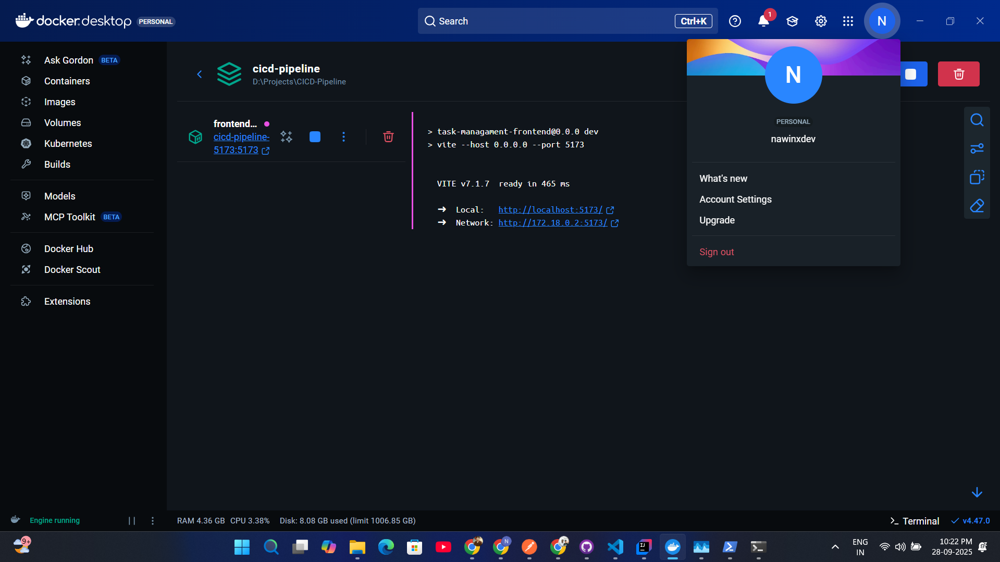
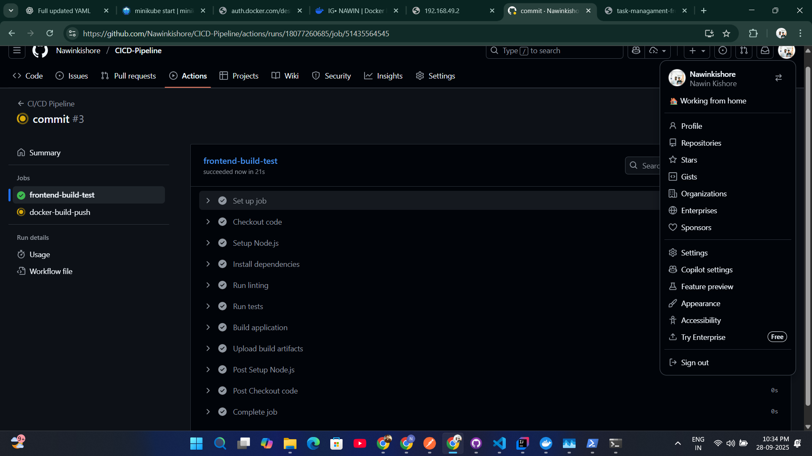

# Task Management Frontend - CI/CD Pipeline

This repository demonstrates a complete CI/CD pipeline implementation for a React-based Task Management Frontend application using GitHub Actions and Docker containerization.

## 🎯 Project Purpose

This project showcases modern DevOps practices including:
- **Automated CI/CD Pipeline** with GitHub Actions
- **Docker Containerization** for consistent deployments
- **Multi-platform Image Builds** (AMD64/ARM64)
- **Container Registry Integration** with GitHub Container Registry
- **Automated Testing** and code quality checks
- **Production-ready Deployment** strategies

## 📋 Application Overview

**Task Management Frontend** - A React-based web application that provides:
- Task creation and management interface
- Search and filter functionality
- Task execution capabilities
- Responsive design with Tailwind CSS
- API integration for backend communication

## 🔧 Technology Stack

- **Frontend Framework**: React 19 with TypeScript
- **Build Tool**: Vite
- **Styling**: Tailwind CSS
- **Testing**: Vitest + React Testing Library
- **Containerization**: Docker with multi-stage builds
- **CI/CD**: GitHub Actions
- **Container Registry**: GitHub Container Registry (GHCR)
- **Development**: Docker Compose

## 🐳 Docker Configuration

The application includes comprehensive Docker support for both development and production environments:

### Development Environment
```bash
# Start development server with hot reload
docker-compose up --build frontend-dev
# Access: http://localhost:5173
```

### Production Environment
```bash
# Start production server with Nginx
docker-compose --profile production up --build frontend-prod
# Access: http://localhost:80
```

### Docker Features
- **Multi-stage builds** for optimized production images
- **Hot reload** support for development
- **Volume mounting** for live code changes
- **Multi-platform support** (AMD64/ARM64)
- **Nginx optimization** for production serving

## 🏗️ CI/CD Pipeline Architecture

### Pipeline Triggers
The automated CI/CD pipeline runs on:
- **Push to main/master branch**
- **Pull requests to main/master branch**

### Pipeline Jobs

#### 1. Frontend Build and Test Job
- **Environment**: Ubuntu latest with Node.js 20
- **Dependencies**: Automated installation with npm caching
- **Code Quality**: ESLint linting and TypeScript compilation
- **Testing**: Vitest test suite with coverage reporting
- **Build**: Production asset compilation
- **Artifacts**: Build files uploaded for deployment

#### 2. Docker Build and Push Job
- **Multi-platform Builds**: AMD64 and ARM64 architectures
- **Container Registry**: GitHub Container Registry (GHCR)
- **Image Tagging**: Branch name, commit SHA, and 'latest'
- **Build Optimization**: Docker layer caching for faster builds
- **Security**: Automated vulnerability scanning

### Pipeline Features
- **Parallel Job Execution** for faster builds
- **Dependency Caching** for improved performance
- **Automated Testing** with coverage reports
- **Multi-platform Docker Images** for broad compatibility
- **Container Registry Integration** for image distribution

## 🧪 Testing and Quality Assurance

### Testing Framework
- **Test Runner**: Vitest with React Testing Library
- **Coverage Provider**: V8 for accurate coverage reporting
- **Test Types**: Unit tests, component tests, and integration tests

### Quality Checks
- **ESLint**: Code linting and style enforcement
- **TypeScript**: Static type checking
- **Test Coverage**: Automated coverage reporting
- **Build Validation**: Production build verification

### Running Tests Locally
```bash
# Run tests with coverage
npm run test:ci

# Run tests in watch mode
npm test

# Run linting
npm run lint

# Build for production
npm run build
```

## 🔧 Environment Configuration

### API Configuration
Configure the backend API URL using environment variables:

```bash
# Copy example environment file
cp .env.example .env

# Edit with your backend URL
VITE_API_URL=http://localhost:8080/tasks
```

## 🚀 Quick Start

### Local Development
```bash
# Install dependencies
npm install

# Start development server
npm run dev
# Access: http://localhost:5173
```

### Docker Development
```bash
# Start with Docker Compose
docker-compose up --build frontend-dev
# Access: http://localhost:5173
```

## 📸 CI/CD Pipeline Demonstration Screenshots

This section demonstrates the successful implementation and execution of the CI/CD pipeline with Docker containerization.

### 1. Docker Development Environment


*Docker development environment showing successful container build and application running on http://localhost:5173 with hot reload functionality*

### 2. GitHub Actions CI/CD Pipeline


*GitHub Actions workflow execution showing successful CI/CD pipeline with automated testing, building, and Docker image publishing to GitHub Container Registry*

## 📋 Pipeline Demonstration Summary

The screenshots demonstrate:
- ✅ **Docker Development Environment** - Successful containerization and local development
- ✅ **GitHub Actions CI/CD Pipeline** - Automated testing, building, and deployment
- ✅ **Container Registry Integration** - Docker images published to GitHub Container Registry
- ✅ **Multi-platform Support** - AMD64/ARM64 architecture builds
- ✅ **Automated Testing** - Test execution with coverage reporting
- ✅ **Production Ready** - Complete CI/CD workflow from code to deployment

## 🎯 Quick Start Commands

### Local Development
```bash
# Start Docker development environment
docker-compose up --build frontend-dev
# Access: http://localhost:5173
```

### Testing and Building
```bash
# Run tests with coverage
npm run test:ci

# Build for production
npm run build

# Run linting
npm run lint
```

### CI/CD Pipeline
```bash
# Trigger pipeline by pushing to GitHub
git add .
git commit -m "CI/CD Pipeline Implementation"
git push origin main
```

## ✅ Success Criteria

Your CI/CD pipeline demonstration is complete when:
- ✅ Local application runs successfully on port 5173
- ✅ All tests pass with coverage reporting
- ✅ GitHub Actions pipeline completes successfully
- ✅ Docker images are published to GitHub Container Registry
- ✅ Both frontend-build-test and docker-build-push jobs succeed

---

**🎉 Your CI/CD Pipeline is Ready for Demonstration! 🚀**
